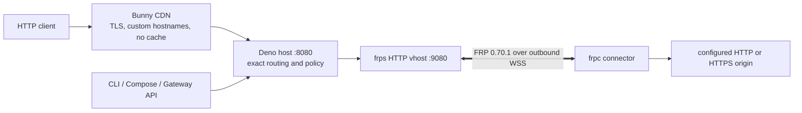

# Architecture and research

Research was refreshed on 2026-09-09 against official Bunny, Deno, GitHub, Dev
Container, Docker, Kubernetes, and upstream FRP documentation.

## Chosen architecture

Bunny Hole combines a small Deno control/HTTP plane with unmodified FRP 0.70.1 for the
multiplexed tunnel. The host OCI contains `bunny-hole-host` and `frps`; connector OCI
and native bundles contain `bunny-hole` and `frpc`.

Use two CDN-facing hostnames/endpoints:

1. a public/management CDN endpoint mapped to container port 8080; and
2. a connector CDN endpoint mapped to port 7000 with WebSockets enabled.

The connector uses FRP `wss` on port 443, so Bunny owns the public TLS certificate and
the host container needs no certificate private key. Direct TCP, QUIC, and unencrypted
WebSocket transports are rejected outside explicit local-development mode.

Public requests enter the Deno host, which reserves all control paths, rejects unknown
hostnames, replaces forwarding headers, and streams to the loopback FRP HTTP virtual
host while preserving the selected `Host`. FRP multiplexes concurrent streams over the
single outbound connector session. A viewer can never name an enrollment, proxy, local
host, or port.

## Why FRP, not a new tunnel protocol

The earlier implementation used a bespoke binary WebSocket multiplexer. It worked, but
duplicated mature, security-sensitive mechanics: multiplexing, flow control, connection
lifecycle, heartbeats, reconnection, HTTP virtual hosts, native portability, and server
authorization hooks. FRP already provides these and has independent users and years of
interoperability testing. Bunny Hole standardizes the enrollment/control API and a
strict FRP profile instead of forking FRP or wrapping a nonexistent Node FRP library.

Prior art considered:

- [Cloudflare Tunnel](https://developers.cloudflare.com/cloudflare-one/connections/connect-networks/)
  validates the outbound-connector and named-route model, but its protocol and control
  plane are tied to Cloudflare's managed service.
- [FRP](https://gofrp.org/en/docs/) provides the closest reusable data plane, including
  HTTP virtual hosts, connection multiplexing, WSS transport, and server plugins.
- [WireGuard](https://www.wireguard.com/protocol/) and Wiredoor are excellent layer-3
  private overlays. They do not supply hostname publication, HTTP header policy, or
  per-service ingress and would require routed private addressing on both sides.
- [inlets](https://docs.inlets.dev/), [rathole](https://github.com/rapiz1/rathole),
  [chisel](https://github.com/jpillora/chisel), [bore](https://github.com/ekzhang/bore),
  localtunnel, ngrok, SSH reverse forwarding, and Kubernetes ingress products informed
  lifecycle and UX choices but have a narrower protocol, hosted dependency, or
  unsuitable authorization boundary.
- AssemblyScript/Wasm is not a better connector target today. WASI networking support
  and Kubernetes Wasm runtimes are less portable than a normal multi-architecture OCI,
  while FRP already ships native binaries. Language-specific clients can implement the
  documented HTTPS API and execute the release-matched `frpc`.

## Identity and enrollment

The host persists an Ed25519 signing identity. Every device or cluster creates a
different Ed25519 pair for each host. Enrollment sends only the public key and displays
a phrase derived from its fingerprint. The owner approves a bounded grant with either a
user-verified passkey or an offline owner recovery key.

Owner signatures include the host identity, purpose, enrollment, device public key,
canonical grant, and a host-issued one-use challenge. This prevents replay or
substitution across hosts and grants. Connector authentication independently signs a
fresh, one-use 192-bit challenge. The resulting host-signed admission token expires
after five minutes and can start an FRP session only before expiry.

The loopback-only FRP plugin verifies login, records the latest admitted session for an
enrollment, and checks every proxy name, type, and exact hostname against durable route
state. A new login deterministically replaces the prior session; its next operation or
heartbeat is rejected within the 45-second dead-session window. Existing streams are not
migrated. Revocation blocks new sessions and all subsequent plugin operations.

Passkeys use SimpleWebAuthn 13.3.2, require user verification and resident credentials,
consume one-use challenges, and persist signature counters. Browser ceremonies run on
the management origin through short-lived fragment-token URLs, while the offline owner
private key remains in the CLI process. Operators should keep at least two passkeys and
an offline recovery copy.

## Bunny findings and consequences

- [Magic Containers deployment](https://bunny.net/docs/magic-containers/deploy)
  explicitly supports single-region deployments and CDN endpoints mapped to container
  ports. Bunny Hole fixes the topology at one region and one instance.
- [Health checks](https://bunny.net/docs/magic-containers/health-checks) support
  startup, readiness, and liveness HTTP checks. `/readyz` does not pass until FRP
  listens; shutdown makes both endpoints fail before connections are closed.
- [Limits](https://bunny.net/docs/magic-containers/limits) currently document 8 CPUs, 32
  GiB RAM, 1 Gbps ingress/egress, 500 outbound connections, and 10 GB ephemeral storage
  per standard instance; trials use 1 CPU and 4 GiB. These are platform ceilings, not
  Bunny Hole sizing promises.
- [Persistent volumes](https://bunny.net/docs/magic-containers/persistent-volumes) are
  encrypted, pod-local, and currently limited to two volumes of up to 100 GB each on a
  standard account. Bunny Hole needs one small volume mounted at `/var/lib/bunny-hole`.
- [Autoscaling](https://bunny.net/docs/magic-containers/autoscaling) can create multiple
  instances. It must be disabled by setting minimum and maximum replicas to one.
- [CDN WebSockets](https://bunny.net/docs/cdn/websockets) must be enabled for the
  connector endpoint. New Pull Zones default to 500 concurrent sockets; current pricing
  is $0.235 per million connection-minutes plus normal CDN bandwidth. The page does not
  publish a guaranteed idle or maximum connection duration, so FRP sends a 20-second
  heartbeat and reconnects, but operators must not assume a contractual lifetime.
- [Magic Container pricing](https://bunny.net/magic-containers/) currently lists $0.02
  per CPU-core-hour, $0.005 per GB-hour of RAM, $0.10 per GB-month of persistent
  storage, and regional bandwidth from $0.01/GB. Pricing is time-sensitive; confirm it
  before deployment.
- [Magic Container logs](https://bunny.net/docs/magic-containers/logs) and log
  forwarding should be configured when durable history is required. Bunny Hole emits
  secret-free JSON logs.
- Bunny's
  [GitHub deployment guide](https://bunny.net/docs/magic-containers/deploy-with-github-actions)
  requires the account API key and says sub-user accounts are unsupported. The current
  [API-key documentation](https://bunny.net/docs/account/api-keys) describes that key as
  full-account access and documents no OIDC or scoped temporary deployment credential.
  Automated deployment is therefore optional, manual, environment-protected, and uses an
  immutable image plus a commit-pinned official action.
- Bunny documents no Edge Script isolate-affinity or addressable live-socket primitive.
  An Edge Script request can execute away from the isolate holding a connector socket;
  Origin Shield is an origin/cache feature, not documented stateful session affinity.
  Edge Scripting is therefore not part of Bunny Hole.

## Why one instance cannot become many by adding a database

SQLite stores enrollments, grants, routes, passkeys, challenges, and a bounded audit
trail on `/var/lib/bunny-hole`. FRP control sockets, flow-control windows, and in-flight
HTTP streams are process and kernel objects. A database can record metadata but cannot
serialize or move those live objects.

Multiple replicas or regions need a connection gateway plus deterministic affinity, or
an authenticated ordered stateful-messaging design with backpressure, cancellation,
deduplication, failure recovery, and handover. Bunny's per-pod volumes are not shared
between replicas. Until that design is implemented and fault-tested, scaling remains
fixed at one.

Rolling updates can briefly overlap pods, so plan a maintenance window and verify that
exactly one healthy instance remains. Bunny Hole makes no zero-downtime failover claim.

## Deliberate future boundaries

Public WebSocket forwarding, raw TCP/UDP, and TLS passthrough are feasible FRP features,
but they are absent because each changes policy and testing materially: WebSockets need
subprotocol/extension and bidirectional backpressure rules; L4 ingress needs Bunny
Anycast endpoint lifecycle, port grants, abuse controls, and end-to-end tests. Shipping
untested switches would widen the attack surface without completing those products.

High availability is also future work for the stateful-routing reasons above. Automatic
Bunny hostname creation is kept out of the always-on host because it would require a
full-account, long-lived Bunny API key. Use the dashboard or a separately reviewed
Terraform workflow instead.

## Toolchain and supply chain

- Deno 2.9.5 is pinned in `.tool-versions`, containers, CI, and documentation. Deno's
  [lockfile](https://docs.deno.com/runtime/reference/deno_json/) is frozen and its
  dependency graph is prewarmed in the development image.
- Node/npm exist only for GitHub Copilot/Dev Container tooling and npm-package
  compatibility checks. Deno remains the task runner.
- FRP release archives are checksum verified against `third_party/frp.json` in both
  Docker and native-release builds.
- Releases are tag-only ComVer, immutable, multi-architecture, SBOM'd, attested, and
  digest-addressable. The GHCR development prebuild and BuildKit layers are the primary
  CI caches; named `/deno-dir` is only a local iterative cache.
