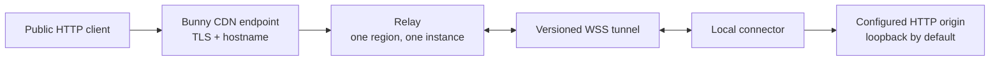

# Architecture and platform research

Research was refreshed on 2026-07-24 against primary documentation.

## Decision

Bunny Hole uses a Bunny Magic Container CDN endpoint as the relay origin. The CDN
terminates public TLS and forwards HTTP and WebSocket upgrades to port 8080 in the
container. The local connector opens an outbound WSS connection to the same endpoint. No
Edge Script is required: Deno's server in the container performs authentication,
hostname routing, framing, proxying, health checks, and limits.

## Bunny findings

- [Magic Containers](https://docs.bunny.net/magic-containers) runs ordinary container
  images and includes CDN endpoints and load balancing.
- [Deployment modes](https://docs.bunny.net/magic-containers/deploy) include an explicit
  single-region deployment without autoscaling. This is the required mode for the MVP.
- A [CDN endpoint](https://docs.bunny.net/magic-containers/endpoints) maps HTTP(S) to a
  configured container port. Sticky sessions exist, but are not a sufficient
  multi-instance design: connector and viewer requests do not naturally share a stable
  client identifier, failover loses process-owned sockets, and pending requests still
  require message routing.
- [Health checks](https://docs.bunny.net/magic-containers/health-checks) support
  startup, readiness, and liveness HTTP GETs. Use `/readyz` for startup/readiness and
  `/healthz` for liveness.
- [Limits](https://docs.bunny.net/magic-containers/limits) currently include 8 CPU, 32
  GiB memory, 10 GB ephemeral storage, 1 Gbps ingress/egress, up to 10 instances per
  region, and automatic restart behavior. Bunny Hole needs no persistent volume.
- [Autoscaling](https://docs.bunny.net/magic-containers/autoscaling) is CPU-driven. It
  must remain disabled (one minimum and maximum instance) for this release.
- [Pricing](https://docs.bunny.net/magic-containers/pricing) charges CPU seconds, RAM in
  64 MB hourly increments, and regional egress; traffic delivered through CDN is billed
  by CDN rather than as container egress. A minimum instance still accrues charges per
  the [FAQ](https://docs.bunny.net/magic-containers/faqs).
- [CDN WebSockets](https://docs.bunny.net/cdn/websockets) must be enabled on the Pull
  Zone. The current included allowance is 500 concurrent connections; additional
  connection tiers and ordinary CDN bandwidth are charged as documented there.
- The CDN WebSocket page does not currently publish an idle timeout or maximum
  connection duration. Edge Scripting's separate WebSocket runtime documents a
  two-minute no-client-data close, but that is not evidence of the CDN-to-container
  limit. Bunny Hole therefore sends application heartbeats every 20 seconds and treats
  45 seconds without traffic as dead. Confirm any CDN-specific hard duration with Bunny
  support for critical deployments.
- The official
  [GitHub Actions deployment guide](https://docs.bunny.net/docs/magic-containers-github-action)
  currently shows `BunnyWay/actions/container-update-image@main`. A mutable action
  reference is unsuitable for a privileged release pipeline. The manual workflow in this
  repository instead performs one small, reviewable API call after an explicit GitHub
  Environment approval.
- The
  [Magic Containers API](https://docs.bunny.net/api-reference/magic-containers/overview)
  authenticates with an account `AccessKey`. Current deployment documentation says
  sub-user accounts are unsupported and documents neither OIDC federation nor scoped
  temporary deployment credentials. Automated deployment therefore requires a long-lived
  `BUNNYNET_API_KEY`; leave it disabled unless the risk is accepted and store it only in
  a protected GitHub Environment.

## Runtime and tooling findings

- Deno 2.9.3 is pinned in `.tool-versions`, the Dev Container, production build, CI, and
  this documentation. Deno provides TypeScript checking, formatting, linting, tests,
  coverage, compilation, permissions, WebSocket APIs, and
  [frozen lockfiles](https://docs.deno.com/runtime/packages/).
- The relay uses `ServeHandlerInfo.completed` to distinguish completed delivery from a
  viewer disconnect. It never trusts a viewer-supplied CDN/IP header; forwarded address
  metadata comes from the relay socket peer until Bunny documents an authenticated
  client-IP signal for Magic Container endpoints.
- The compiled relay receives only environment and network permissions. The connector
  additionally receives read permission for an optional restricted config file. There
  are no third-party runtime packages.
- Docker Compose models relay, connector, and origin on an isolated network. The relay
  and connector use the same production Dockerfile targets used for deployment.
- The `development` Compose service builds the entire pinned development toolchain,
  mounts the repository and Docker socket, and runs as a non-root user. Dev Container
  metadata adds editor settings only—there are no Features or lifecycle mutations—so
  plain Docker Compose, compatible editors, and
  [devcontainers/ci](https://github.com/devcontainers/ci) all use the same image.
- GitHub's special
  [Copilot setup workflow](https://docs.github.com/en/copilot/how-tos/copilot-on-github/customize-copilot/customize-cloud-agent/customize-the-agent-environment)
  requires one `copilot-setup-steps` job and runs before the agent. It builds the Dev
  Container and prewarms dependencies, but does not receive deployment secrets or run
  the full suite.
- Release images use GitHub
  [artifact attestations](https://docs.github.com/en/actions/how-tos/secure-your-work/use-artifact-attestations/use-artifact-attestations)
  and an SPDX SBOM. Attestations establish provenance, not code safety.
- The connector is Web-platform TypeScript with no `Deno.*` use in its public module
  graph. The CLI/config adapter remains Deno-specific. Current
  [Deno pack](https://docs.deno.com/runtime/reference/cli/pack/) transpiles that source
  graph and emits npm JavaScript and declarations, while
  [JSR publishing](https://jsr.io/docs/publishing-packages) retains the TypeScript
  source. The root package owns the connector and shared protocol graph; relay and
  fixture workspace members remain explicitly non-publishable.
- JSR and npm both support GitHub OIDC publishing. JSR links the package to the
  repository and creates package provenance; npm trusted publishing requires npm
  11.5.1+, Node 22.14+, an exact repository/workflow match, and `id-token: write`.
  Release publishing therefore uses the pinned development image and no registry write
  token. See [JSR provenance](https://jsr.io/docs/trust) and
  [npm trusted publishers](https://docs.npmjs.com/trusted-publishers/).
- Deno's supported cross-compile targets cover Linux x86-64/ARM64, macOS x86-64/ARM64,
  and Windows x86-64. Those connector binaries and both multi-platform OCI images
  receive GitHub artifact provenance; see
  [Deno compile](https://docs.deno.com/runtime/reference/cli/compile/) and
  [GitHub artifact attestations](https://docs.github.com/en/actions/how-tos/secure-your-work/use-artifact-attestations/use-artifact-attestations).

## State and scaling

The session registry and pending request map are intentionally in relay memory. A
database cannot store a live WebSocket object, its kernel connection, buffered frames,
or the `ReadableStream` controllers for in-flight HTTP responses.

Multiple replicas would need both:

1. deterministic routing/session affinity that sends a tunnel's connector and every
   public request to the same healthy relay; or
2. a stateful connection gateway plus bounded authenticated messaging that routes
   request frames to the process owning the connector.

Failover semantics, deduplication, ordering, load, and backpressure must be tested as a
distributed system. No multi-region or multi-replica claim is made here.
