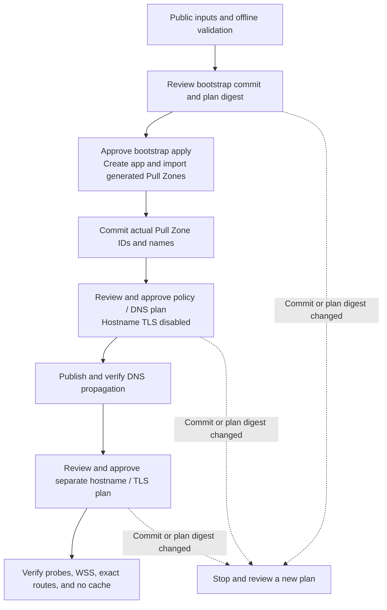

# Consumer GitOps deployment template

[`templates/bunny-deployment`](../templates/bunny-deployment) is a complete, copyable
starting repository for operating one released Bunny Hole host. It is a GitHub
repository template, not a Bunny dashboard-catalog entry: Bunny does not currently
publish a documented repository schema that creates a complete Magic Container
application, both CDN policies, custom hostnames, TLS, and DNS from a dashboard “deploy
from repository” flow.

The shortest consumer path uses the deployment archive from the exact published release,
rather than a source checkout:

```sh
version=1.0.0-rc.3 # Select this only for explicitly approved RC evaluation.
archive="bunny-hole-deployment-${version}.tar.gz"
gh release download "$version" --repo zimme/bunny-hole --pattern "$archive"
gh attestation verify "$archive" --repo zimme/bunny-hole
mkdir my-bunny-deployment
tar -xzf "$archive" -C my-bunny-deployment --strip-components=1
cd my-bunny-deployment
bash scripts/setup.sh
```

The archive is attested by the release workflow after testing the published images. Its
`release.json` records the release commit and both image digests; its public example
already uses that exact host version/digest. Customize public application/backend inputs
and, for an approved RC evaluation only, explicitly set `allow_release_candidate=true`.
Stable versions need no opt-in. Private release verification, account protections,
backend setup, credentials, DNS review, and restore readiness remain prerequisites.

Run `deno task deployment:scaffold ../my-bunny-deployment` from a Bunny Hole checkout to
copy the entire checked template, including hidden workflows, agent guidance, shared
deployment scripts, and offline guard tests. It refuses an existing destination. In the
new directory, `bash scripts/setup.sh` creates the two public configuration files
without overwriting edits. Configure those files, then follow the template's protected
plan/review/apply procedure; scaffolding performs no live operation.

The template uses Terraform 1.16.2 and `BunnyWay/bunnynet` 0.18.2 because the official
provider exposes the required application, Pull Zone, hostname, managed-TLS, and Bunny
DNS resources. It consumes the already published host image; it does not rebuild this
project or grant a consumer repository permission to publish upstream artifacts.

## Declared topology

The configuration deliberately creates exactly:

- one Magic Container application in one allowed and required region;
- one running host instance with autoscaling disabled;
- one persistent volume mounted at `/var/lib/bunny-hole`;
- one port-8080 CDN endpoint for management and exact public application hostnames;
- one port-7000 CDN endpoint for connector WSS only; and
- zero wildcard hostnames, public container ports, Edge Scripts, databases, or extra
  replicas.

Both Pull Zones have dynamic caching, error caching, request coalescing, redirects, and
origin retries disabled. Only the connector zone enables WebSockets. Custom hostname
resources are disabled until DNS propagation is reviewed; their later stage requests
Bunny-managed TLS. Optional `PullZone` records may be created only in an existing Bunny
DNS zone; the template never creates a zone or changes nameservers.

## Why bootstrap is a reviewed transaction



A CDN endpoint nested in `bunnynet_compute_container_app` causes Magic Containers to
create its Pull Zone. Terraform cannot declare the same zone independently before it
exists without proposing a duplicate. The protected workflow therefore:

1. produces a target-only bootstrap plan and reports the exact default-branch commit and
   canonical plan digest;
2. requires those reviewed values as explicit inputs to the separate bootstrap apply;
3. reproduces the plan, verifies both bindings, and target-applies only
   `bunnynet_compute_container_app.host`;
4. refreshes and reads the generated Pull Zone IDs from the two endpoint outputs;
5. imports them at `bunnynet_pullzone.public` and `bunnynet_pullzone.connector`;
6. emits a secret-free bootstrap handoff containing each imported zone's actual
   generated ID, name, and CDN domain; and
7. stops without applying policy changes.

The operator commits the handoff's exact generated IDs and names, then runs full plan
mode. The Terraform guard reads those IDs from Bunny, requires each one to equal its
corresponding Magic Container endpoint-generated Pull Zone, requires public and
connector identities to remain distinct, and fails if names do not match. That prevents
a replacement-only Pull Zone rename from becoming routine drift cleanup. First review
and apply only the imported edge policy and any optional Bunny DNS records while
`enable_hostname_tls=false`; no custom hostname/TLS resources exist in that stage. For
external DNS, publish the CNAME/alias records to the safe CDN-domain outputs. After DNS
propagation is independently verified, review a separate commit that sets
`enable_hostname_tls=true`, then authorize the final hostname/TLS plan and apply. Apply
fails if the default branch or normalized plan content changed. Bootstrap is idempotent
after partial failure: keep the sentinels, rerun bootstrap, and it verifies an existing
import against the generated endpoint before importing only a missing address. Endpoint
and container blocks are ordered provider lists, so renaming or reordering them is a
reviewed identity change, not routine cleanup.

## Trust and secret boundaries

Pull requests run only backend-free formatting, validation, and mock-provider regression
tests. Live plan/bootstrap/ apply jobs run only by manual dispatch from the exact
protected default branch and use a pre-created `production` GitHub Environment.
Configure required reviewers, prevent self-review, restrict deployment branches, and
disable bypass where the GitHub plan supports it before storing credentials there.

The environment holds `BUNNYNET_API_KEY` and the example HCP Terraform token
`TF_TOKEN_APP_TERRAFORM_IO`. Current Bunny documentation describes the account API key
for API/action authentication and does not document a scoped OIDC or temporary Magic
Containers deployment credential. HCP Terraform is the example encrypted, locked
remote-state service; another secure backend is valid when its authentication and
workflow mapping are deliberately adapted.

No workflow uploads state or a saved plan, comments a plan on a pull request, or runs
untrusted code with secrets. Plan and apply both use the protected default branch. Apply
accepts only a full commit SHA that still equals that branch's tip, reproduces the
selected plan, verifies its canonical SHA-256, and applies that saved plan. A code or
state change therefore fails closed instead of silently applying a different plan. The
public GHCR image uses Bunny's anonymous GitHub registry connection, avoiding a registry
token in Terraform state.

## Use and validate

Copy the template directory into a new repository, then follow its README. An agent may
fill public values and review changes after reading the copied `AGENTS.md` and
`bunny-hole-setup` skill. A human must enter credentials and handle private identity,
passkey, enrollment, state, plan, and connector material outside the agent conversation.

Maintainers validate the embedded template with:

```sh
deno task deployment-template:check
deno task validate
```

The first command enforces file presence, workflow pins and triggers, topology,
immutable image inputs, secret hygiene, and Terraform policy. The authoritative full
validation runs the same check in the Compose-native development environment. A real
Bunny apply remains an operator-controlled non-production acceptance test because it
requires a broad account credential, incurs cost, and mutates external infrastructure.

See [agent-assisted deployment](agent-assisted-deployment.md) for safe delegation and
[deployment](deployment.md) for connector enrollment, verification, operation, and
manual-dashboard fallback.
