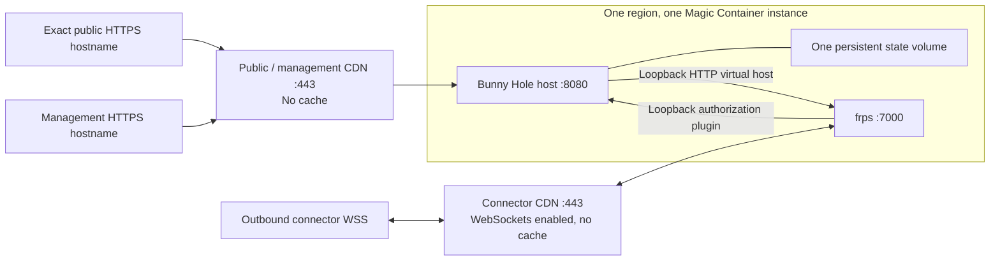

# Bunny Hole deployment repository

This template declares one released Bunny Hole host on Bunny Magic Containers and keeps
its configuration reviewable in Git. It is a GitHub repository template, not a Bunny
dashboard-catalog template. It references the upstream host OCI image by both an
immutable ComVer tag and matching digest; it does not rebuild Bunny Hole.

Start with two public configuration files, then use **Plan deployment** and **Apply
deployment**. Both workflows call the same `scripts/deployment.sh`; the copied
repository includes offline guard tests. No push triggers a live deployment. Private
backend and environment protections, release verification, and staged approvals remain
required.

The resulting topology is deliberately fixed:



The connector initiates its outbound WSS connection. The diagram's bidirectional edges
represent transport over that established session; no inbound connector port is needed.

Terraform provisions the application, one persistent volume, the host container, health
probes, and two CDN endpoints. Magic Containers creates a Pull Zone for each endpoint. A
protected bootstrap operation adopts those generated zones into Terraform; subsequent
plans enforce no caching on either zone, WebSockets only on the connector zone,
Bunny-managed TLS, and optional linked records in an existing Bunny DNS zone.

## 1. Create the repository

The release's attested `bunny-hole-deployment-VERSION.tar.gz` archive contains this
entire repository template, `LICENSE`, and public `release.json`. Verify the archive's
GitHub artifact attestation against `zimme/bunny-hole` before extracting it into a new
directory. It already records the exact release version and tested host digest in the
public example. Run `bash scripts/setup.sh`, then customize the public configuration;
you do not need a Bunny Hole source checkout or Deno to use a release archive. The setup
and offline guard tests use Python 3's standard library; CI provides it.

Copy this directory into a new private repository. Keep `AGENTS.md`, the setup skill,
workflows, scripts, provider lockfile, and Terraform files together. From a Bunny Hole
checkout, `deno task deployment:scaffold ../my-bunny-deployment` copies the complete
validated template into a new directory and refuses an existing destination. Protect the
consumer's default branch, require the `Check deployment` workflow, and require pull
requests for changes.

An AI agent may customize public configuration and run offline checks, but it must read
`AGENTS.md` and `.agents/skills/bunny-hole-setup/SKILL.md` first. Never paste a Bunny
API key, state/backend credential, registry token, owner private key, passkey response,
connector configuration, Kubernetes Secret, Terraform state, or binary plan into an AI
conversation.

## 2. Choose and verify a release

Select an existing Bunny Hole `MAJOR.MINOR.0` release. In a separate private terminal,
verify its provenance and record the host image digest. Generate the owner identity:

```sh
umask 077
bunny-hole owner generate --output ./bunny-hole-owner.json
```

Keep `bunny-hole-owner.json` offline. Only its printed public key belongs in Terraform.
Do not use a branch image, `latest`, or an unreviewed local build.

Stable releases are the default. For an explicitly approved evaluation, use the exact
published lowercase `MAJOR.MINOR.0-rc.N` candidate and its verified digest, then set
`allow_release_candidate=true` in the public configuration. That consent defaults to
false even in an RC archive. A candidate is unstable and does not promise the intended
stable compatibility; promotion is a separately authorized release.

## 3. Configure public inputs

Copy and commit the two non-secret configuration files:

```sh
bash scripts/setup.sh
```

The helper creates only missing files and preserves existing configuration. Supply your
backend organization/workspace and the deployment's application name, region, exact
hostnames, verified release version/digest, and owner public key. The other deployment
settings have conservative defaults. Replace general `REPLACE_WITH` markers, but retain
the four `REPLACE_WITH_BOOTSTRAP_*` Pull Zone ID/name sentinels until the protected
bootstrap workflow records the generated values. Then commit
`deployment.auto.tfvars.json`: it contains public configuration only and the protected
workflows require this file to be present in the repository. Keep local overrides such
as `terraform.tfvars` untracked. Before `terraform init`, create/select the HCP
Terraform workspace and verify in its Settings that **Execution mode is Local** (not
Remote or Agent). This is a required prerequisite because the workflows run Terraform
locally with saved plan files and environment credentials while HCP provides encrypted,
locked remote state. Saved-plan generation fails closed if the workspace is not
configured for local execution. The `cloud` backend cannot encode that workspace
setting. Other secure remote backends are possible, but adapt the workflow credential
mapping and retain encryption, locking, access control, and backup. Never use local
state in shared automation or GitHub caches/artifacts for state.

The deployment variables contain only public configuration: region, hostnames, owner
public key, release version/digest, connector WebSocket capacity, and optional existing
Bunny DNS zone information. External DNS remains outside this stack. Do not put any
credential in `tfvars`.

## 4. Protect the GitHub Environment

Before adding secrets, create a GitHub Environment named `production`:

- require an independent reviewer and prevent self-review;
- allow deployments only from the protected default branch;
- disable administrator bypass where your GitHub plan supports it; and
- add `BUNNYNET_API_KEY` and `TF_TOKEN_APP_TERRAFORM_IO` as environment secrets.

Enter both values through the GitHub UI or private interactive commands such as
`gh secret set --env production`; do not place their values in command arguments or an
agent-controlled terminal. Bunny currently documents the account API key as broad and
does not document a scoped/OIDC Magic Containers credential. HCP tokens should be scoped
only to this workspace.

The public GHCR Bunny Hole image uses Bunny's existing anonymous GitHub registry
connection. If the account lacks that connection, add the public GitHub registry in the
Bunny dashboard. Never model a registry PAT in Terraform: the provider would retain it
in state.

## 5. Validate without credentials

Pull requests and ordinary pushes run only backend-free checks:

```sh
terraform -chdir=terraform fmt -check -recursive
terraform -chdir=terraform init -backend=false -input=false -lockfile=readonly
terraform -chdir=terraform validate -no-color
python3 scripts/test_workflows.py
```

They receive no Bunny or backend secrets. Every action and provider is pinned. Review
the plan for exact hostnames, one region/instance, the image digest, and replacement or
destruction before authorizing a live operation.

## 6. Bootstrap once, then plan and apply

Magic Containers owns initial creation of the CDN Pull Zones. The public configuration
starts with four `REPLACE_WITH_BOOTSTRAP_*` Pull Zone ID/name sentinels. First run
**Plan deployment** manually with `operation=bootstrap`. Review its target-only plan and
record the exact commit and canonical plan SHA-256 printed in the job summary. Then run
**Apply deployment** with `operation=bootstrap`, confirmation `BOOTSTRAP`, and those two
reviewed values. After the protected-environment approval, the workflow verifies that
the commit is still the default-branch tip, reproduces the reviewed plan digest, and
only then:

1. applies only `bunnynet_compute_container_app.host` when absent;
2. reads the two generated Pull Zone IDs from safe Terraform outputs;
3. imports them as `bunnynet_pullzone.public` and `bunnynet_pullzone.connector`; and
4. prints the secret-free `bootstrap_handoff`, including the actual generated Pull Zone
   names and IDs; and
5. stops without applying their policy changes.

Commit the exact four generated ID/name values from `bootstrap_handoff` before planning
again. The full plan fails closed if they do not match the current resources, because a
Pull Zone rename is replacement-only. It also requires that each ID belongs to its exact
Magic Container endpoint and that the public and connector Pull Zones are distinct. Keep
`enable_hostname_tls=false` for the first full policy/DNS plan and apply. This creates
no custom hostnames, so DNS can propagate without racing certificate/TLS creation. If
Bunny DNS is used, its optional records are created in that first stage; otherwise
publish the external CNAME/alias records to the safe CDN-domain outputs. After DNS
propagation is independently verified, set `enable_hostname_tls=true` in a separate
reviewed commit, then run **Plan deployment** and **Apply deployment** with
`operation=apply`, confirmation `APPLY`, and the new commit/plan digest. That final
stage creates managed-TLS custom hostnames and forces HTTPS. Each apply requires the
reviewed commit to remain the default-branch tip and applies only a reproduced plan with
the same canonical digest. The tip check is a best-effort guard rather than an atomic
branch lock, so do not push to the default branch between approval and completion. If
configuration or remote state changed, the digest differs and apply stops. Binary plans,
normalized plan JSON, and state remain on ephemeral runners and are never uploaded as
artifacts or posted to pull requests.

Bootstrap is idempotent after partial failure: rerun the protected bootstrap plan/apply
with the sentinels still present. It refreshes only the existing host and verifies any
already-imported Pull Zone against the endpoint output before importing only an absent
one. Never rename endpoint or container blocks casually: the Bunny provider models them
as ordered lists and an endpoint rename may replace its Pull Zone. Never use
`terraform destroy` as a routine rollback.

## 7. Verify and enroll

After apply, verify the safe outputs and Bunny dashboard:

- exactly one healthy instance in the selected region;
- the released host digest and persistent `/var/lib/bunny-hole` volume;
- `/healthz` and `/readyz` return 200 through the management hostname;
- public/management traffic reaches port 8080 with caching disabled;
- connector WSS reaches port 7000 with WebSockets enabled and caching disabled;
- all configured hostnames have valid managed TLS; and
- no direct public container port or wildcard hostname exists.

In the private terminal, add the host, bootstrap at least two passkeys, approve the
device's least-privilege grant, create an exact route, and start the connector as
documented by Bunny Hole. Keep application authentication enabled.

An AI-visible handoff may include only the values defined in the copied
[`handoff schema`](.agents/skills/bunny-hole-setup/references/handoff-schema.md): public
URLs/hostnames, region, ComVer, digest, resource IDs, generated Pull Zone names/IDs, CDN
domains, and pending manual checks. It must never contain state or credentials.

## Operations

The application volume and encrypted Terraform backend protect different state.
[Bunny volumes](https://bunny.net/docs/magic-containers/persistent-volumes) are
node-bound and provide no automatic backup or replication; disk replacement can lose
their data. Before production, arrange private application-consistent backups and test
restoration of the host identity and SQLite state together. Keep backup contents, keys,
and data out of Git, agents, and workflow artifacts; record only a sanitized restoration
result.

[Volume-backed updates](https://bunny.net/docs/magic-containers/rolling-updates) stop
the old pod first. Schedule downtime and verify connector reconnection. Keep region and
volume identity stable. During a node outage, preserve the volume and wait for recovery
or use a separately reviewed private restore procedure.

- Update by changing both the ComVer tag and matching digest in a pull request,
  reviewing the plan, and using the protected apply workflow. Expect the single host and
  active connector sessions to restart.
- Roll back by restoring the previously recorded compatible digest and repeating the
  same review/apply flow.
- Rotate a connector by enrolling a new key, cutting over, then revoking the old
  enrollment. The Terraform stack never manages device or owner private keys.
- To retire the deployment, revoke enrollments and back up state first. Review a
  targeted destruction plan in a private terminal; this template intentionally provides
  no automated destroy workflow.

See the upstream
[Bunny Hole deployment guide](https://github.com/zimme/bunny-hole/blob/main/docs/deployment.md)
for enrollment, connector, Kubernetes, diagnostics, cost, and application-level security
guidance.
